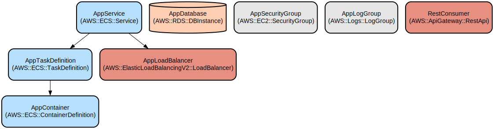

# Reactive Customer Service with Resilient Retry Capabilities

A Spring Boot reactive microservice that provides customer management functionality with built-in resilience patterns, security headers, and comprehensive retry mechanisms for handling transient failures.

This service is built using clean architecture principles and provides a reactive REST API for customer operations. It features exponential backoff retry strategies with jitter, circuit breaker patterns, and comprehensive security headers to ensure reliable and secure customer data management.

The service uses Spring WebFlux for non-blocking operations and implements multiple retry strategies including fixed delay, exponential backoff, and backoff with jitter to handle transient failures gracefully. Security is enforced through strict HTTP headers and CORS configurations.

## Repository Structure
```
.
├── applications/                      # Application entry points and configuration
│   └── app-service/                  # Main Spring Boot application service
├── domain/                           # Core business logic and models
│   ├── model/                        # Domain entities and interfaces
│   └── usecase/                      # Business use cases implementation
├── infrastructure/                   # External interfaces and adapters
│   ├── driven-adapters/             # Outbound ports implementation (REST consumer)
│   └── entry-points/                # Inbound ports implementation (REST API)
└── deployment/                      # Deployment configurations and Dockerfile
```

## Usage Instructions

### Prerequisites
- JDK 17
- Gradle 8.2.1
- Docker (for containerized deployment)

### Installation

1. Clone the repository:
```bash
git clone <repository-url>
cd <repository-name>
```

2. Build the project:
```bash
./gradlew clean build
```

3. Run the application:
```bash
./gradlew bootRun
```

### Quick Start

1. Start the service:
```bash
java -jar applications/app-service/build/libs/NameProject.jar
```

2. Create a new customer:
```bash
curl -X POST http://localhost:8081/api/v1/test \
  -H "Content-Type: application/json" \
  -d '{"name": "John", "lastName": "Doe"}'
```

### More Detailed Examples

1. Creating a customer with retry handling:
```java
Mono<String> result = createCustomerUseCase.createCustomer(new Customer("John", "Doe"));
result.subscribe(
    customerId -> System.out.println("Customer created with ID: " + customerId),
    error -> System.err.println("Error creating customer: " + error.getMessage())
);
```

2. Using the REST consumer:
```java
webClient.post()
    .uri("/create")
    .bodyValue(customerRequest)
    .retrieve()
    .bodyToMono(CustomerResponse.class);
```

### Troubleshooting

1. Connection Timeout Issues
- Error: `Connection refused: connect`
- Solution: Verify the service is running and the port 8081 is available
```bash
netstat -ano | findstr :8081
```

2. Retry Exhaustion
- Error: `CustomRetryExhaustedException: Retries exhausted`
- Solution: Check the backend service availability and logs
```bash
tail -f logs/application.log
```

3. CORS Issues
- Error: `Access-Control-Allow-Origin header missing`
- Solution: Add your origin to application.yaml:
```yaml
cors:
  allowed-origins: "http://localhost:4200,your-origin"
```

## Data Flow

The service implements a reactive flow for customer creation with resilient retry mechanisms.

```ascii
Client Request → REST API → Use Case → Repository → External Service
     ↑            [Retry Layer]          ↓
     └────────────[Response]────────────┘
```

Key component interactions:
1. REST API receives customer creation request
2. Request is validated and transformed by Mapper
3. UseCase implements retry logic with backoff strategies
4. Repository attempts external service communication
5. Retry mechanism handles transient failures
6. Circuit breaker prevents cascade failures
7. Security headers are applied to responses
8. CORS rules are enforced for cross-origin requests

## Infrastructure



### Spring Boot Configuration
- Server port: 8081
- Application name: NameProject
- H2 console enabled for development

### Circuit Breaker Configuration
- Failure rate threshold: 50%
- Slow call duration threshold: 2s
- Sliding window size: 10 calls
- Wait duration in open state: 10s

### Security Headers
- Content-Security-Policy
- Strict-Transport-Security
- X-Content-Type-Options
- Cache-Control
- Referrer-Policy

## Deployment

### Prerequisites
- Docker installed
- Network access to Docker registry

### Deployment Steps
1. Build Docker image:
```bash
docker build -t customer-service -f deployment/Dockerfile .
```

2. Run container:
```bash
docker run -p 8081:8081 \
  -e JAVA_OPTS="-XX:+UseContainerSupport -XX:MaxRAMPercentage=70" \
  customer-service
```